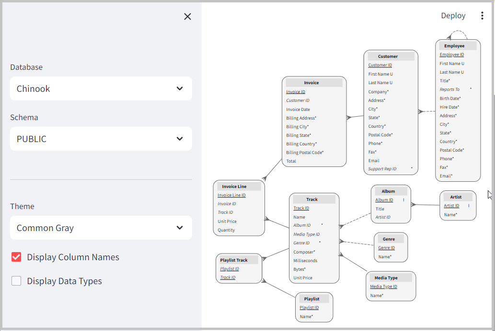
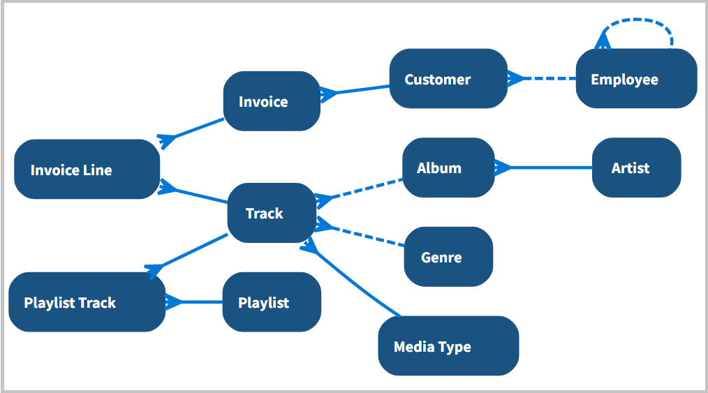
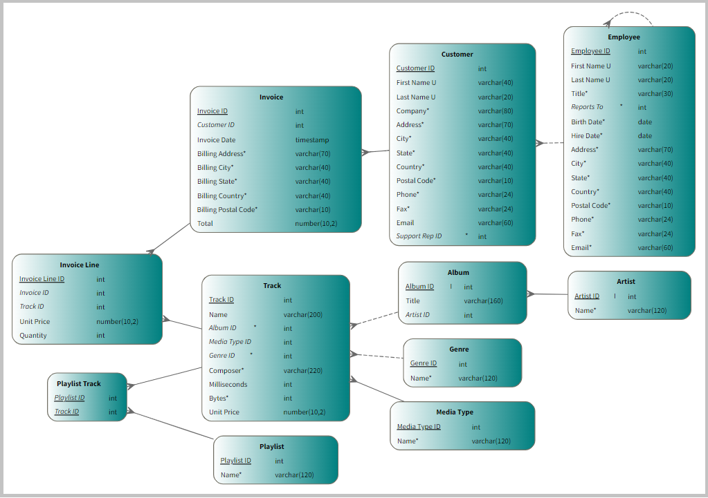
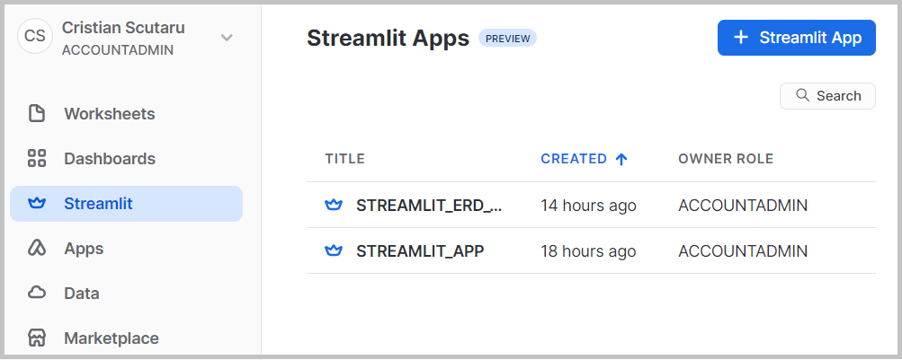

Streamlit ERD Viewer
====================

Simple Entity-Relationship diagram generator and viewer for any database schema from your Snowflake account. 

Can be installed right away as a Streamlit App in your Snowflake account. Or tested locally as a Streamlit web application.

ERD Viewer
----------

Select one database and schema, change the theme and adjust the display options. Here is a typical diagram with table columns and PK-FK relationships between the tables:

Can show table entities only, with no column names:

Or full information about each table, with column names and their data types:

Script Generator
----------------

It generates as well the create DDL script:

Snowflake Connection
--------------------

To connect locally from the web app to your Snowflake account:

* [Install SnowSQL](https://docs.snowflake.com/en/user-guide/snowsql-install-config).
* Locate the **`~/.snowsql/config`** file.
* Add a **[connection.my_conn]** section with the Snowflake *accountname*, *username* and *password*.

Local Streamlit App
-------------------

To test and run the Streamlit application locally, on Windows, in VSCode or your own Python IDE:

* Clone this repository on your local machine, then open the IDE with the folder of this project. Make sure you have installed a Python version supported by Snowpark (v8, v9, or v10 at this moment).
* In a Terminal window, create a virtual environment with **`python -m venv venv`**. Switch to this new environment with **`venv/scripts/activate`**.
* Run **`pip install -r requirements.txt`**, to install the Snowpark and Streamlit dependencies.
* Call **`streamlit run app.py`** to open the web app in your browser. Type **CTRL+C** in the Terminal to stop the web app.

Streamlit App in Snowflake
--------------------------

To install and run this as a Streamlit app in your Snowflake account:

* To create an empty Chinook sample database, paste and run the **scripts/chinook.sql** script in a new worksheet. Or run **`snowsql -c my_conn -f scripts/chinook.sql`** from a Terminal window.
* In **deploy.sql**, change with the path to your **app.py** file. Then run **`snowsql -c my_conn -f scripts/deploy.sql`**, which will (re)create a **STREAMLIT_ERD_VIEWER** database, will load the Python file in a stage and will create a Streamlit app from this file. As an alternative, in a new database (and schema), create a new Streamlit app with the default template. Then replace the Python code with the full content of our **app.py** file.
* Test and run the Streamlit app online. Share a link to this app with other roles or users.
* To cleanup, drop the database with this Streamlit object. Or run **`snowsql -c my_conn -f scripts/cleanup.sql`** from a Terminal.

